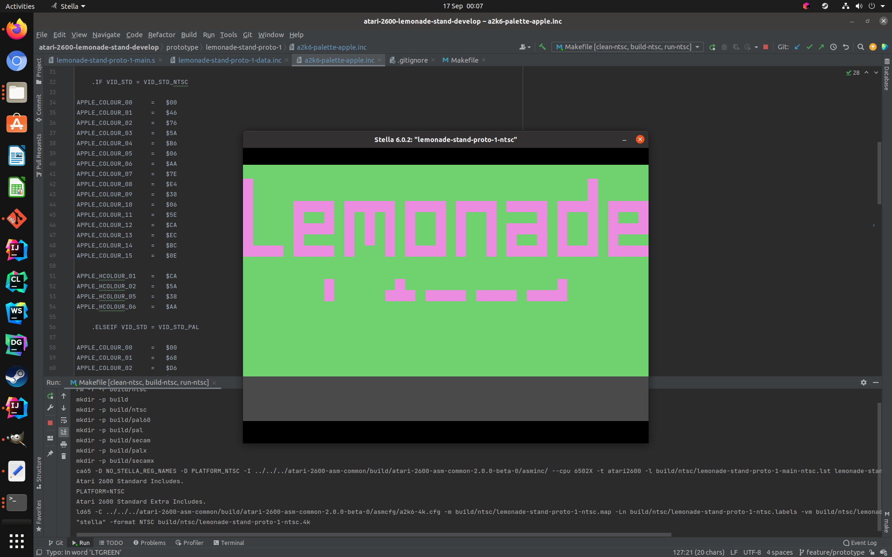

# JiggleSoft's Atari 2600 Game

## Lemonade Stand

This is an Atari 2600 retro remake of the Apple II version by Charlie Kellner in February 1979. Charlie Kellner version was modified for the Apple computer from the original program by Bob Jamison of the Minnesota Educational Computing Consortium (MECC).

This game is work in progress with no specified completion date.
I have a lot of other commitments and do not want to give a concrete release date.

This will be released as a physical release with cartridge, box, and manual etc.

I am anticipating that the games source code, artwork, documentation, binary rom image, etc. to this game will be released as open source approximately one year after the cartridges have been made available to be purchased. 

This game also depends on several other libraries and those libraries will be released separately as individual open source projects upon their completion:-

  * Atari 2600 Common Includes: Constants, Macros, Fonts, Kernels, SFX, Music etc.
  * 65XX CPU Fixed Point Math Library.

## Task List and Status

| Status | Item | Notes |
|--------|------|-------|
| IN PROGRESS | Apple Code Analysis | Analysis of existing code. An annotated source code document will be published. |
| IN PROGRESS | Atari 2600 Design | Document detailing the design of the Atari 2600 version. |
| IN PROGRESS | BCD Fixed Point Math Library. | Will be released as a separate 65XX CPU library. |
| IN PROGRESS | Atari 2600 Common Includes. | Separate library that requires some additional kernels and routines to support this game. |
| IN PROGRESS | Game Code Mock Up | Demonstration application containing graphics and sound. |
| TO DO | Game Code | The final application. |
| TO DO | Media | Manual, Box art, etc. |
| TO DO | Publish Game | Game to be published. | 

## Screen Shots

### Game Code Mock Up Work-In-Progress

---

## Licensing

Copyright (C) 2022 Justin Lane.

## Contact Us

Please email atari2600@jigglesoft.co.uk regarding this repository.

